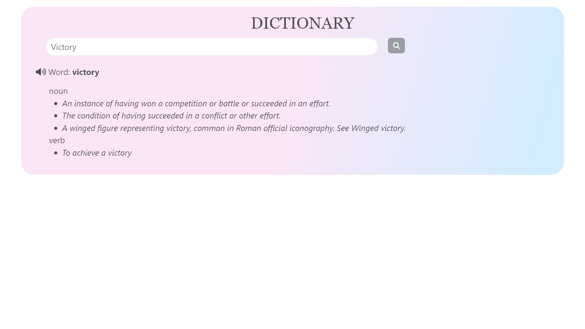

# Day-20 Dictionary App

This project is to create and display the Dictionary app by fetching information from the API (https://api.dictionaryapi.dev/api/v2/entries/en/${word}).

We can get the meaning of the word from the dictionary by entering the word in search box and a click of search button.

To view the Dictionary app in browser [Click Here](https://dreamy-dictionary.netlify.app/)

 

